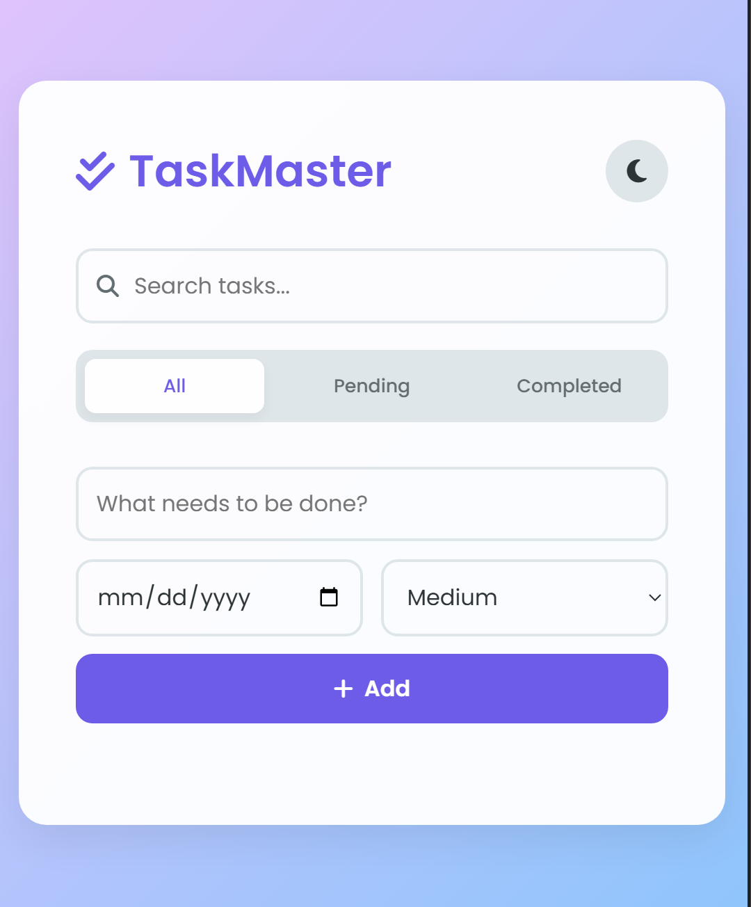

# 🚀 Smart Task Manager (TaskMaster)

A modern and responsive **Task Management Web App** built using **HTML, CSS, and JavaScript**.
It helps users efficiently manage daily tasks with features like filtering, search, priority, and dark mode.

---

## 📸 Preview



---

## ✨ Features

* ✅ Add, delete, and manage tasks
* 📅 Set **due dates** for tasks
* 🔥 Assign **priority levels** (Low, Medium, High)
* 🔍 Search tasks in real-time
* 🎯 Filter tasks:

  * All
  * Pending
  * Completed
* 🌙 Dark mode (saved using localStorage)
* 💾 Data persistence using **Local Storage**
* 📱 Fully responsive design

---

## 🛠️ Tech Stack

* **HTML5**
* **CSS3 (Modern UI + Variables + Animations)**
* **JavaScript (Vanilla JS)**
* **Font Awesome Icons**
* **Google Fonts (Poppins)**

---

## 📂 Project Structure

```id="4amzfm"
Smart-Task-Manager/
│── index.html
│── style.css
│── script.js
```

---

## 🌐 Live Demo

👉 [Click Here to View Live](https://your-netlify-link.netlify.app)

---

## 💡 Future Improvements

* ✏️ Edit existing tasks
* 🔄 Drag & drop task reordering
* 🔐 User authentication (login/signup)
* ☁️ Backend integration (Node.js + MongoDB)

---

## 👨‍💻 Author

**Ajit Kumar Saini**
📍 Uttar Pradesh, India

* 🔗 Portfolio: https://ajit-kumar-saini-portfolio.netlify.app/
* 🔗 GitHub: https://github.com/ajitkumarsaini02
* 🔗 LinkedIn: https://www.linkedin.com/in/ajit-kumar-saini-74340932/

---

## ⭐ Support

If you like this project, give it a ⭐ on GitHub!

---
